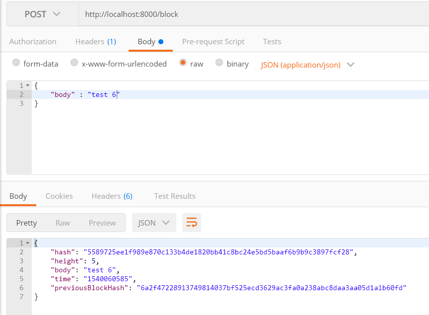

## Project overview
This project is used to build a RESTful API using a Node.js framework that will interfaces with the private blockchain By configuring an API for your private blockchain you expose functionality that can be consumed by several types of web clients ranging from desktop, mobile, and IoT devices. 

For your next project, you will be creating a RESTful web API for your private blockchain. 

The API project will require two endpoints:
- GET block
- POST block

## Project Prerequisites 
- Web Service Fundamental
- Web Service with Node.js
- Utilizing Node.js Third-Party Libraries

## Project specification

https://review.udacity.com/#!/rubrics/1707/view

## Framework used

Express.js

## Endpoints:
| Type | Endpoint      | Function                                                                  |
|------|---------------|---------------------------------------------------------------------------|
| GET  | /block/:index | Returns a block by ID                                                     |
| POST | /block/       | Creates a new block with data that's inside the post data with key "data" |


---

## Getting Started
Open a command prompt or shell terminal execute:
```
npm install
```

To start server, after install node.js and execute:
```
node app.js
```


## Testing
To test code, use a software like postman or a simple CURL on the terminal to send the requests to the base url http://localhost:8000 with one of the below supported endpoints:

- GET
/block/{BLOCK_HEIGHT}

Example:

```
 curl http://localhost:8000/block/0
```

Response: 
```
{
"hash":"49cce61ec3e6ae664514d5fa5722d86069cf981318fc303750ce66032d0acff3",
"height":0,
"body":"First block in the chain - Genesis block",
"time":"1530311457",
"previousBlockHash":""
}
```


- POST
/block

Example:

```
curl -X "POST" "http://localhost:8000/block" -H 'Content-Type: application/json' -d $'{"body":"test 6"}'
```

Response:

